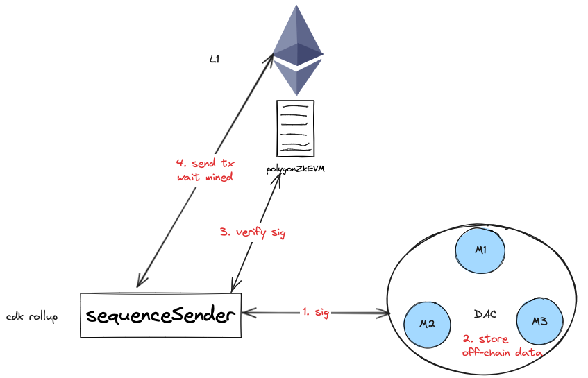

# SequencerSender部分

## 1.发送batch数据

- sequenceSender会启动一个定时器，定时去发送Sequence: 
`tryToSendSequence`
- `tryToSendSequence` , 先确保已经同步到最高区块
- 获取需要发送的sequences
- 将这些sequences发送给dac成员，dac会返回包含签名和dac成员地址的信息：signaturesAndAddrs
- 与合约交互，拿到txData  
    - 构建batch数据：包含每个seq的L2Data对应的hash值
    - 将batch数据和signaturesAndAddrs发送给合约：polygonZkEVM
    - 合约polygonZkEVM中会调用datacommitee合约校验batch和签名数据s
- txData加入到txMgr，最后发给L1，并确认L1已经收到
## 2.数据流程

1. sequenceSender将batch数据发送给dac中的每个member, 每个member存储batch数据，并返回自己的签名。
2. sequenceSender将dac所有member的签名和addr聚合在一起，形成signaturesAndAddrs。
3. sequenceSender将batch hash、signaturesAndAddrs发送给L1上的合约polygonZkEVM。
4. polygonZkEVM会校验dac members签名
5. 向L1发送交易，并等待确认。  